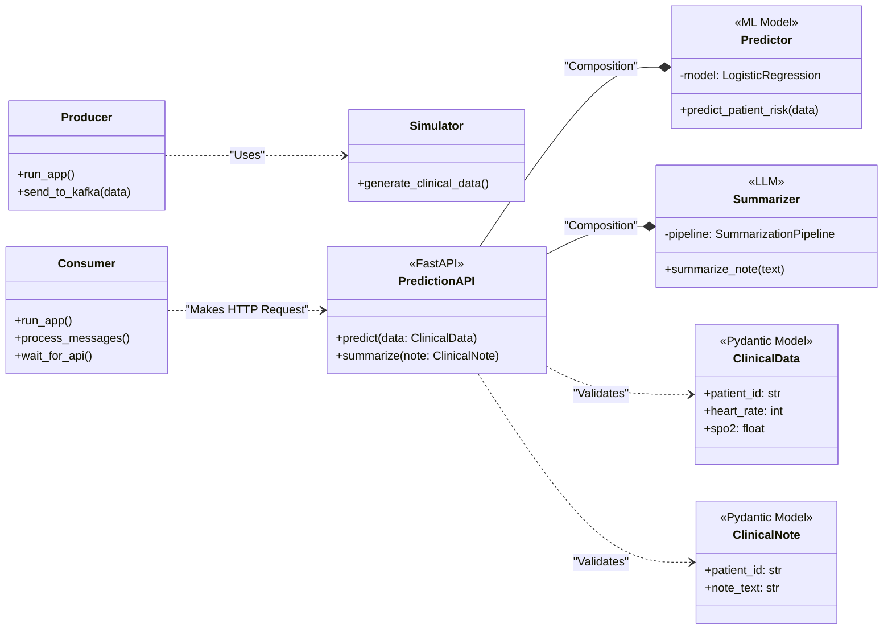
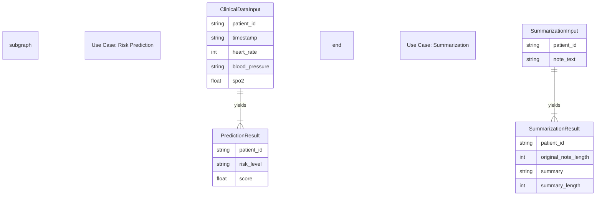
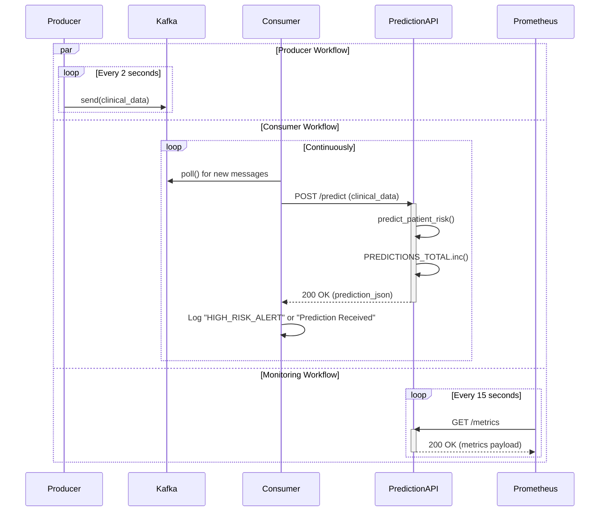
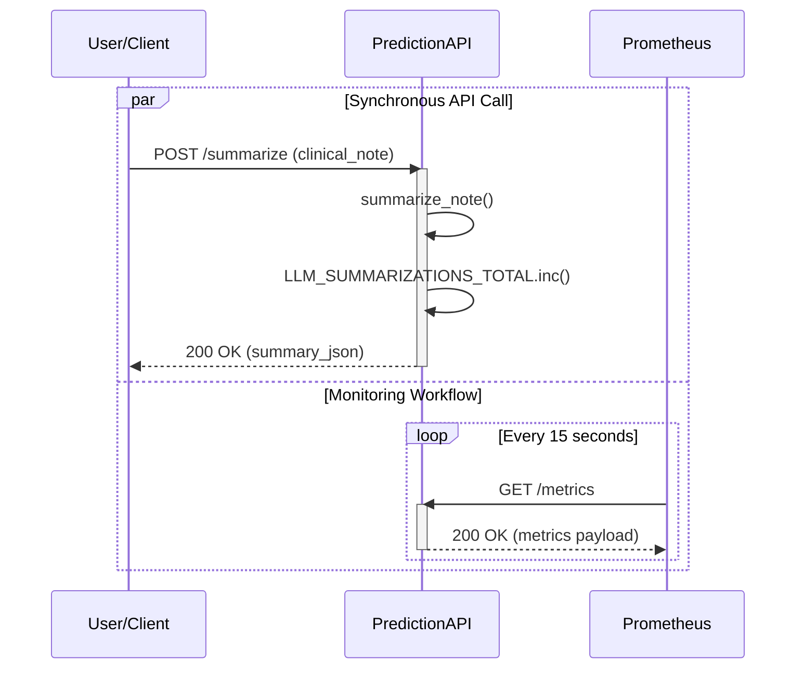
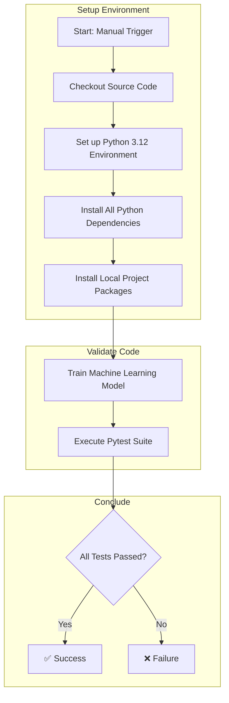

# AURA: Automated Real-time Analytics

AURA is a comprehensive, event-driven AI system built to demonstrate a realistic healthcare use case. It simulates a stream of clinical data, processes it through a Kafka pipeline, makes predictions using both a traditional ML model and a generative LLM, and visualizes the results in a monitoring dashboard.

### Key Features

*   **Microservices Architecture:** Decoupled services for data production, API serving, and consumption.
*   **Event-Driven:** Uses Apache Kafka as a resilient message broker.
*   **Dual AI Models:**
    *   **Risk Prediction:** A `scikit-learn` logistic regression model predicts patient risk from vital signs.
    *   **GenAI Summarization:** A `transformers`-based LLM provides summarization for clinical notes.
*   **Full Observability Stack:**
    *   **Prometheus** for metrics collection.
    *   **Grafana** for dashboarding and visualization.
*   **Containerized:** Fully containerized with Docker and orchestrated with Docker Compose.
*   **Tested and Automated:** Includes a full suite of unit tests with `pytest` and a CI pipeline with GitHub Actions.

### Architecture

```
┌─────────────────┐   ┌─────────┐   ┌─────────────────┐   ┌────────────────┐
│   Producer      │──>│  Kafka  │──>│    Consumer     │──>│  Prediction API│
│ (simulated data)│   │ (topic) │   │ (processes data)│   │ (ML & LLM)     │
└─────────────────┘   └─────────┘   └─────────────────┘   └───────┬────────┘
                                                                  │
                                                                  ▼
                                                          ┌─────────────┐
                                                          │ Prometheus  │
                                                          │ (metrics)   │
                                                          └──────┬──────┘
                                                                 │
                                                                 ▼
                                                          ┌─────────────┐
                                                          │   Grafana   │
                                                          │(dashboards) │
                                                          └─────────────┘
```

### Prerequisites

*   Python 3.12+
*   Docker and Docker Compose

### Getting Started (Local Development)

1.  **Clone the repository:**
    ```bash
    git clone https://github.com/zhu-weijie/aura-clinical-analytics
    cd aura-clinical-analytics
    ```

2.  **Create and activate a virtual environment:**
    ```bash
    python -m venv venv
    source venv/bin/activate
    # On Windows, use: venv\Scripts\activate
    ```

3.  **Install all dependencies:**
    This command installs the requirements for the applications, development, and testing.
    ```bash
    pip install -r requirements.txt -r requirements-api.txt -r requirements-consumer.txt -r requirements-dev.txt -r requirements-test.txt
    ```

4.  **Install local packages in editable mode:**
    This crucial step makes your local source code importable, which is necessary for `pytest`.
    ```bash
    pip install -e .
    pip install -e packages/aura_core
    ```

5.  **Train the ML Model:**
    This script creates the `aura_risk_model.joblib` file needed by the prediction service.
    ```bash
    python notebooks/train_model.py
    ```

### Running the Tests

After setting up the environment, you can run the entire test suite with a single command. The first run will be slow as it downloads the LLM for testing.

```bash
pytest
```

### Running the Full Application

This single command will build all Docker images and start all services.
```bash
docker compose up --build
```

### Accessing Services

Once the application is running, the services are available at:

*   **Prediction API Docs:** [http://localhost:8000/docs](http://localhost:8000/docs)
*   **Prometheus UI:** [http://localhost:9090](http://localhost:9090)
*   **Grafana Dashboard:** [http://localhost:3000](http://localhost:3000) (Login: `admin` / `admin`)

### Design Diagrams

#### Class Diagram



#### Entity Relationship Diagram



#### Real-Time Risk Prediction Flow



#### LLM Summarization Flow



### CI Diagram


