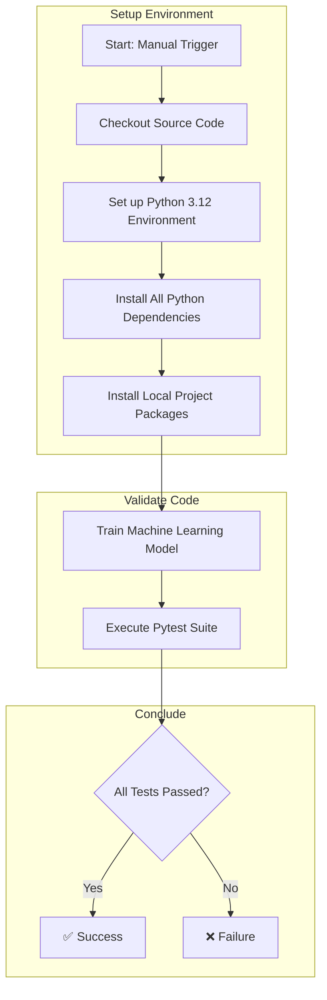

```mermaid
graph TD
    subgraph Setup Environment
        A["Start: Manual Trigger"] --> B["Checkout Source Code"];
        B --> C["Set up Python 3.12 Environment"];
        C --> D["Install All Python Dependencies"];
        D --> E["Install Local Project Packages"];
    end

    subgraph Validate Code
        F["Train Machine Learning Model"] --> G["Execute Pytest Suite"];
    end

    subgraph Conclude
        H{"All Tests Passed?"} -- Yes --> I["✅ Success"];
        H -- No --> J["❌ Failure"];
    end

    E --> F;
    G --> H;
```
