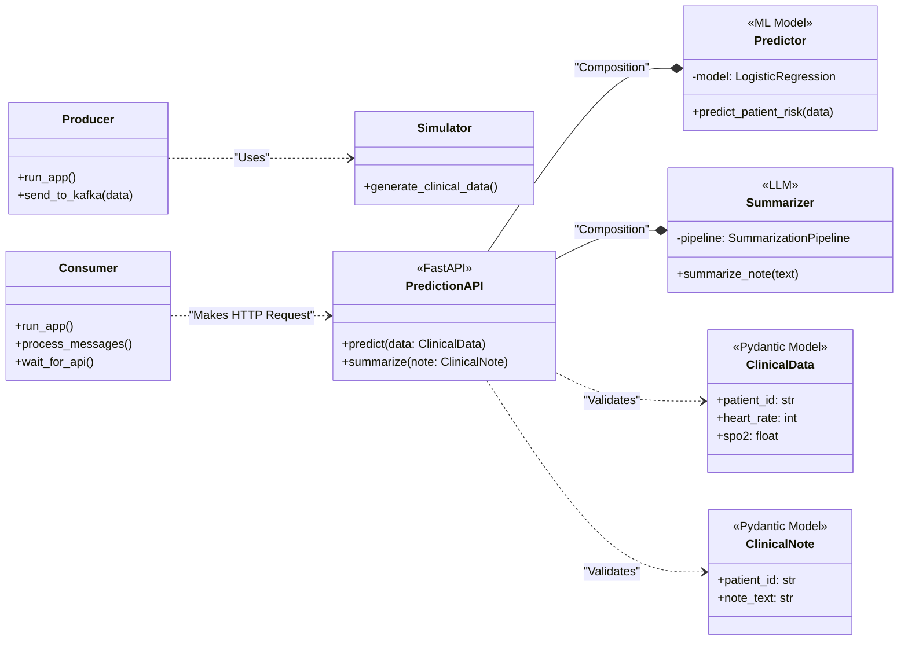

```mermaid
classDiagram
    direction LR

    class Consumer {
      +run_app()
      +process_messages()
      +wait_for_api()
    }
    
    class Producer {
      +run_app()
      +send_to_kafka(data)
    }

    class Simulator {
      +generate_clinical_data()
    }

    class PredictionAPI {
      <<FastAPI>>
      +predict(data: ClinicalData)
      +summarize(note: ClinicalNote)
    }

    class Predictor {
      <<ML Model>>
      -model: LogisticRegression
      +predict_patient_risk(data)
    }

    class Summarizer {
      <<LLM>>
      -pipeline: SummarizationPipeline
      +summarize_note(text)
    }

    class ClinicalData {
      <<Pydantic Model>>
      +patient_id: str
      +heart_rate: int
      +spo2: float
    }

    class ClinicalNote {
      <<Pydantic Model>>
      +patient_id: str
      +note_text: str
    }

    Consumer ..> PredictionAPI : "Makes HTTP Request"
    Producer ..> Simulator : "Uses"
    PredictionAPI --* Predictor : "Composition"
    PredictionAPI --* Summarizer : "Composition"
    PredictionAPI ..> ClinicalData : "Validates"
    PredictionAPI ..> ClinicalNote : "Validates"
```
