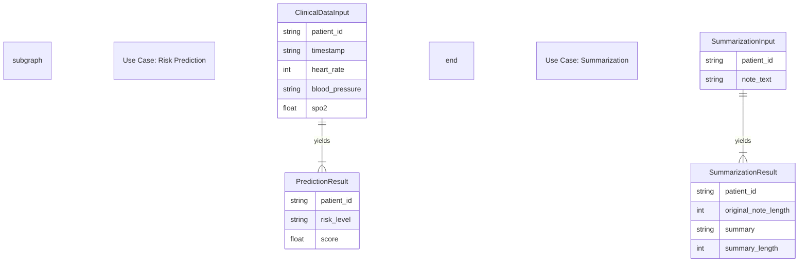

```mermaid
erDiagram

    subgraph "Use Case: Risk Prediction"
        ClinicalDataInput {
            string patient_id
            string timestamp
            int heart_rate
            string blood_pressure
            float spo2
        }
        PredictionResult {
            string patient_id
            string risk_level
            float score
        }
    end

    subgraph "Use Case: Summarization"
        SummarizationInput {
            string patient_id
            string note_text
        }
        SummarizationResult {
            string patient_id
            int original_note_length
            string summary
            int summary_length
        }
    end

    ClinicalDataInput ||--|{ PredictionResult : "yields"
    SummarizationInput ||--|{ SummarizationResult : "yields"
```
