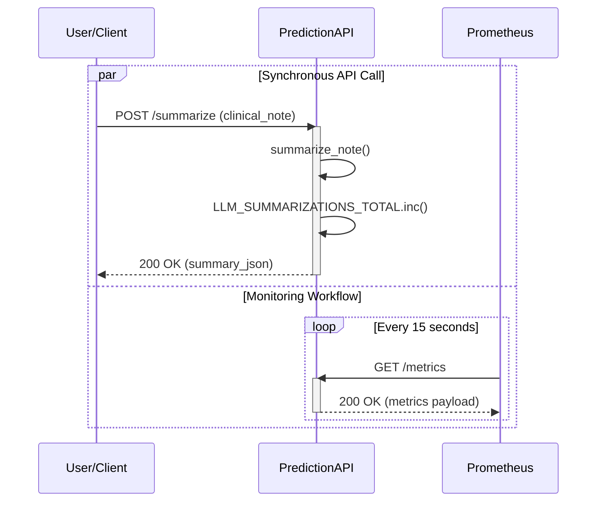

```mermaid
sequenceDiagram
    participant User/Client
    participant PredictionAPI
    participant Prometheus

    par Synchronous API Call
        User/Client->>PredictionAPI: POST /summarize (clinical_note)
        activate PredictionAPI
        PredictionAPI->>PredictionAPI: summarize_note()
        PredictionAPI->>PredictionAPI: LLM_SUMMARIZATIONS_TOTAL.inc()
        PredictionAPI-->>User/Client: 200 OK (summary_json)
        deactivate PredictionAPI
    and Monitoring Workflow
        loop Every 15 seconds
            Prometheus->>PredictionAPI: GET /metrics
            activate PredictionAPI
            PredictionAPI-->>Prometheus: 200 OK (metrics payload)
            deactivate PredictionAPI
        end
    end
```
