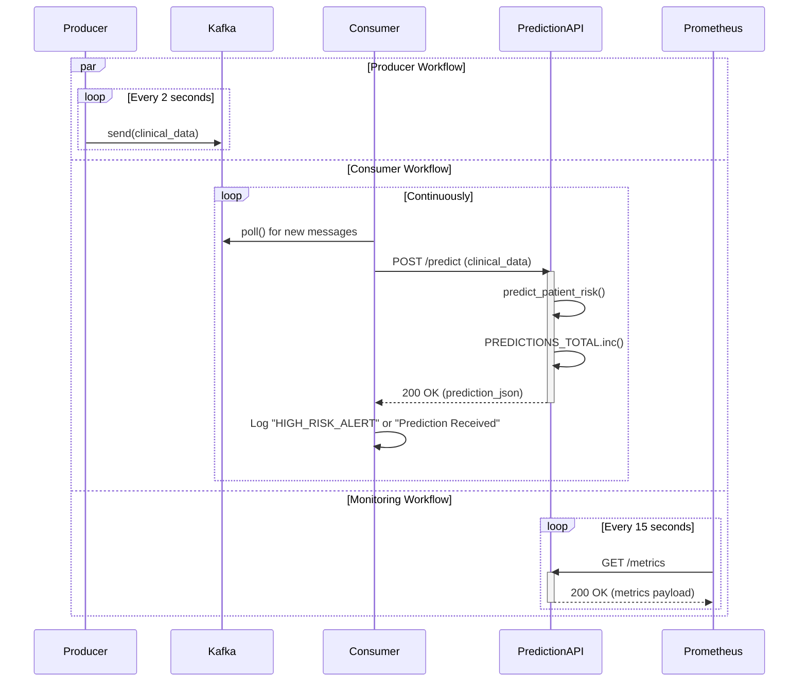

```mermaid
sequenceDiagram
    participant Producer
    participant Kafka
    participant Consumer
    participant PredictionAPI
    participant Prometheus

    par Producer Workflow
        loop Every 2 seconds
            Producer->>Kafka: send(clinical_data)
        end
    and Consumer Workflow
        loop Continuously
            Consumer->>Kafka: poll() for new messages
            Consumer->>PredictionAPI: POST /predict (clinical_data)
            activate PredictionAPI
            PredictionAPI->>PredictionAPI: predict_patient_risk()
            PredictionAPI->>PredictionAPI: PREDICTIONS_TOTAL.inc()
            PredictionAPI-->>Consumer: 200 OK (prediction_json)
            deactivate PredictionAPI
            Consumer->>Consumer: Log "HIGH_RISK_ALERT" or "Prediction Received"
        end
    and Monitoring Workflow
        loop Every 15 seconds
            Prometheus->>PredictionAPI: GET /metrics
            activate PredictionAPI
            PredictionAPI-->>Prometheus: 200 OK (metrics payload)
            deactivate PredictionAPI
        end
    end
```
